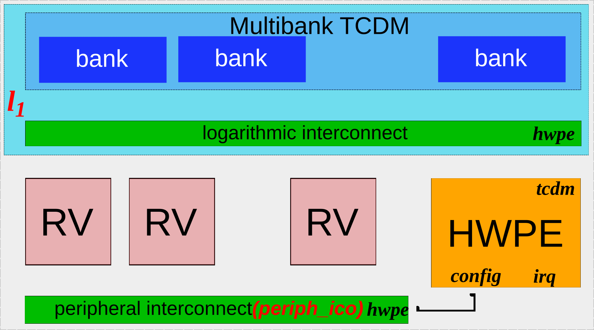
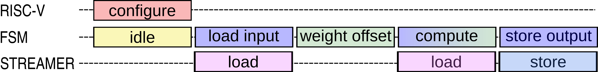
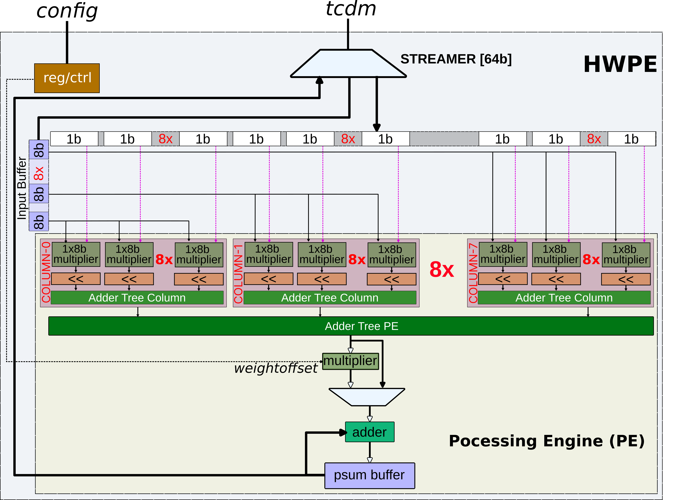

Tutorial - Developing a hardware accelerator
---------------------------------------------
This tutorial is designed to provide a comprehensive, hands-on experience in implementing Hardware Processing Engine (HWPE) and connecting it to the PULP platform using the GVSoC simulation environment. You will learn how to design and implement key components of the HWPE, integrate it with the PULP platform, and develop a software application to test our new integrated system.

The tutorial is located here: ``pulp/docs/developer_manual/tutorials/hwpe``

Navigate to the tutorial directory before running any commands, and set ``GVSOC_ROOT`` for use in build and run commands:

.. code-block:: bash

   $ cd pulp/docs/developer_manual/tutorials/hwpe
   $ export GVSOC_ROOT=$(realpath ../../../../../)

All ``make`` commands for task setup are run from this directory. ``make build`` is also available here and delegates to the GVSoC root. Commands invoking the ``gvsoc`` binary use ``$GVSOC_ROOT`` as shown throughout this tutorial.
The main directory where you need to manually operate on files, instead, is ``gvsoc/pulp``.

0 - Getting familiar with the file structure
.............................................
This is the directory structure of ``gvsoc/pulp``:

.. admonition:: Directory Structure

    .. code-block:: text

      pulp/pulp
      |-- pulp-open.py
      |-- pulp
          |-- chips
          |   |-- pulp_open
          |       |-- cluster.json
          |       |-- cluster.py
          |       |-- l1_subsystem.py
          |       |-- pulp_open.py
          |       |-- pulp_open_board.py
          |-- neureka
          |-- simple_hwpe
              |-- inc
              |-- src
              |-- CMakeLists.txt
              |-- simple_hwpe.py

   - **/pulp**: Contains all the necessary source code for the tutorial.
   - **/pulp/pulp-open.py**: GVSoC target, similar to the chip name in the RTL context.
   - **/pulp/chips**: Different chips related setups.
   - **/pulp/chips/pulp-open/cluster.json**: Cluster configuration and memory maps.
   - **/pulp/chips/pulp-open/l1_subsystem.py**: Python generator for the L1 subsystem.
   - **/pulp/chips/pulp-open/cluster.py**: Main cluster wrapper connecting different components of the cluster.
   - **/pulp/neureka**: C++ model of hardware accelerator Neureka.
   - **/pulp/simple_hwpe**: C++ model of hardware accelerator simple_hwpe for today's tutorial.
   - **/pulp/simple_hwpe/inc**: Relevant includes.
   - **/pulp/simple_hwpe/src**: C++ source codes.
   - **/pulp/simple_hwpe/CMakeLists.txt**: Compilation file requirements.
   - **/pulp/simple_hwpe/simple_hwpe.py**: Python generator to instantiate the simple_hwpe.

1 - Create a new target on the top of pulp-open
................................................
In this section, you will create a new Hardware Target ``pulp-open-hwpe`` which is a replica of the pulp-open consisting of a pulp-cluster. Later we will develop on the ``pulp-open-hwpe`` to add our accelerator.

After the installation is done, run the setup command which creates the scaffolded hwpe target files with inline hints.

.. admonition:: Task - 1.0 setup the source files
   :class: task

   .. code-block:: bash

      $ make create_target_task

The command creates a new gvsoc target ``pulp-open-hwpe.py`` at ``gvsoc/pulp/`` by patching ``pulp-open.py``, and a new folder ``pulp/chips/pulp_open_hwpe/`` by copying ``pulp/chips/pulp_open/`` and adding inline hints in the relevant files.

The new target should work like the pulp-open because it is derived from the pulp-open. To verify that it is working, build `gvsoc` using `TARGET=pulp-open-hwpe` and run the same hello binary with this target.

.. admonition:: Verify - 1.1
   :class: solution

   .. code-block:: bash

      $ cd pulp/docs/developer_manual/tutorials/hwpe
      $ make build TARGETS=pulp-open-hwpe
      $ $GVSOC_ROOT/install/bin/gvsoc --target=pulp-open-hwpe --binary $GVSOC_ROOT/examples/pulp-open/hello run

You should see the Hello code passing successfully.

.. admonition:: Task-1.2.1 Familiarize the contents of pulp-open-hwpe.py
   :class: task

   Open the newly created ``pulp-open-hwpe.py`` and familiarise yourself. What are your observation?

It is a `GAPY_TARGET`. It relies on the imports from the `pulp/chips/pulp_open` folder. Next we will create a dedicated SoC with a pulp-cluster using the pulp-open template.

The ``make create_target_task1`` command also created a dedicated ``pulp_open_hwpe`` folder at ``gvsoc/pulp/pulp/chips/`` as a copy of ``pulp_open``, with inline hints added to the relevant files. In the later exercises we will change the contents of the ``pulp_open_hwpe`` folder.

Even though ``pulp_open_hwpe`` was created, ``pulp-open-hwpe.py`` still points to the ``pulp_open`` folder.
The next part is to change the dependencies to point to the new ``pulp_open_hwpe`` files by replacing the correct path for the model imports.

.. admonition:: Task-1.2.3 Fix the dependencies for pulp-open-hwpe
   :class: task

   Edit `$GVSOC_ROOT/pulp/pulp-open-hwpe.py`:

   .. code-block:: python

      from pulp.chips.pulp_open_hwpe.pulp_open_board import Pulp_open_board
      import gvsoc.runner as gvsoc

   Similarly, the references in the following files needs to be modified. Look for the inline hints.

   .. code-block:: text

       $GVSOC_ROOT/pulp/pulp/chips/pulp_open_hwpe
       |-- pulp_open_board.py
       |-- pulp_open.py
       |-- cluster.py

   In `pulp_open.py`, `__init__` defaults must also be modified for the new platform name.
   
After modifications, you can verify that the changes are correct by building GVSoC with the new target
and running the hello application again by executing the following commands:

.. admonition:: Verify - 1.2.3
   :class: solution

   .. code-block:: bash

      $ make build TARGETS=pulp-open-hwpe
      $ $GVSOC_ROOT/install/bin/gvsoc --target=pulp-open-hwpe --binary $GVSOC_ROOT/examples/pulp-open/hello run

The test should pass without any issue. How do you know if your changes are reflected correctly?

.. admonition:: Information
   :class: explanation

   GVSoC generates a ``gvsoc_config.json`` file in the ``$GVSOC_ROOT`` folder when an application is executed. This is a tool generated file and you can find all the address maps as well as the component connections. Now we can see the changes such as ``cluster_config_file: pulp/chips/pulp-open-hwpe/cluster.json`` in the generated ``gvsoc_config.json`` file.

2 - Integrating a HWPE target to the hwpe-target
................................................

Adding a HWPE target requires a functional model written in C++ and Python generators to integrate to the SoC. We will use the functional model located in the ``gvsoc/pulp/pulp/simple_hwpe`` directory. Our focus in this section will be on integrating the existing simple_hwpe into the newly created target ``pulp_open_hwpe``. Details of the simple_hwpe will be discussed in Section 3, where the model is extended with relevant features.

Let's begin the setup for this task by copying the relevant source files for pulp_open_hwpe. These are the same files as before, with additional comments to guide you through the process.

.. admonition:: Task - 2.1 Setup
   :class: task

   .. code-block:: bash

      $ make integrate_hwpe_task

All the necessary modifications are to be done in ``gvsoc/pulp/pulp/chips/pulp_open_hwpe/cluster.json``. To include the new HWPE accelerator in the PULP system, an entry of the cluster needs to be updated in ``cluster.json``. The entry needs to be added below the ``dma`` entry as its base address comes next.

.. admonition:: Task - 2.1.1 Add HWPE entry to address map
   :class: task

   The base address 0x10201c00 and a size of 0x400 is reserved for the registers of the new HWPE accelerator. The JSON entry is the following:

   .. code-block:: json

      "hwpe": {
          "mapping": {
              "base": "0x10201c00",
              "size": "0x00000400",
              "remove_offset": "0x10201c00"
          }
      },

After the ``hwpe`` is instantiated in ``cluster.json``, the hwpe model needs to be instantiated in the ``cluster.py`` file taking into account the architecture specific to the cluster. To instantiate the HWPE in the cluster, you have to first import the python generator of the ``hwpe.py`` located in the ``simple_hwpe`` folder.

.. admonition:: Task - 2.1.2 Instantiate HWPE in the Cluster
   :class: task

   Import the Hwpe Python wrapper into ``cluster.py`` of the ``pulp_open_hwpe`` module. Use the import from NE16 as a reference:

   .. code-block:: python

        from pulp.simple_hwpe.hwpe import Hwpe

   The next step is to instantiate the Hwpe in the cluster.py. Again take inspiration from NE16

   .. code-block:: python

        hwpe = Hwpe(self, 'hwpe')

Now the HWPE is instantiated in the cluster. However, there are no connections made to the other components in the cluster!
A brief overview of the connection is given in the below picture. A pulp-cluster template consists of a cluster of RISC-V cores connected to a Multibank
shared Tightly coupled data memory (TCDM). The HWPE could be configured by an of the RISC-V core in the cluster through the peripheral interconnect connected to the
configuration port of the HWPE. The HWPE consists of the streamers, to access the L1 memory to load/store the processed data.

First, we will start connecting the peripheral interconnect to the configuration port of the ``Hwpe`` This involves two steps. First, create an entry in the peripheral interconnect to accommodate the ``Hwpe`` This is where we can make use of the ``Hwpe`` entry in the ``cluster.json``. Secondly, the port binding is made between the peripheral interconnect and the HWPE.

.. admonition:: Task - 2.1.3 Connection of Hwpe with the Peripheral interconnect
   :class: task

   Add the following line to create an entry to the peripheral interconnect with the port name of the Hwpe

   .. code-block:: python

        periph_ico.add_mapping('hwpe', **self._reloc_mapping(cluster_conf.get_property('peripherals/hwpe/mapping')))

   The next part is to connect the peripheral interconnect's hwpe port to the config port of the Hwpe.

   .. code-block:: python

        self.bind(periph_ico, 'hwpe', hwpe, 'config')

In the previous steps, we added hwpe to the peripheral interconnect. Now let's add the port towards the TCDM. This also takes a similar approach to the peripheral interconnect. First, we need to add an additional port to the L1 subsystem. But this requires changes into the ``l1_subsystem.py`` file as follows:

.. admonition:: Task - 2.1.4 Adding dedicated port for Hwpe in the L1 subsystem
   :class: task

   Open the ``l1_subsystem.py`` and familiarise yourself.

   .. code-block:: python

        l1_interleaver_nb_masters = nb_pe + 4 + 1 + 1

   Expose the added port as hwpe to outside using bind. Again take a hint from NE16

Next, we go back to the cluster.py file. The L1 subsystem is instantiated as l1. Thus, we connect the l1's port named hwpe to the Hwpe's port named ``tcdm``.

.. admonition:: Task - 2.1.4 Connection of Hwpe with L1 subsystem
   :class: task

   Connect the ``Hwpe``'s ``tcdm`` port to the ``l1``'s ``hwpe`` port

   .. code-block:: python

        self.bind(hwpe, 'tcdm', l1, 'hwpe')

The last part of the integration is to connect the event signal ``irq`` of the Hwpe to the cores.

.. admonition:: Task - 2.1.4 Connection of Hwpe with L1 subsystem
   :class: task

   Connect the Hwpe's ``irq`` port to the ``event_unit``'s ``hwpe_irq`` port

   .. code-block:: python

        hwpe_irq = cluster_conf.get_property('pe/irq').index('acc_1')
        for i in range(0, nb_pe):
            self.bind(hwpe, 'irq', event_unit, 'in_event_%d_pe_%d' % (hwpe_irq, i))

.. admonition:: Verify - 2
   :class: solution

   .. code-block:: bash

      $ make build TARGETS=pulp-open-hwpe
      $ $GVSOC_ROOT/install/bin/gvsoc --target=pulp-open-hwpe --binary $GVSOC_ROOT/examples/pulp-open/hello run

.. admonition:: Fixing failing build
   :class: task

   Search for hwpe in the gvsoc_config.json file. What went wrong?
   Add the simple_hwpe folder in gvsoc/pulp/pulp/CMakeLists.txt. Then rebuild the model and run the hello application as done previously.

3 - Intrinsics of the Hwpe development
......................................
The HWPE (Hardware Processing Engine) we are modeling today is a basic module designed to perform pointwise convolution. The execution steps are illustrated in the diagram below.

Initially, the HWPE's finite state machine (FSM) is in the IDLE state. Configuration of the HWPE is done by one of the RISC-V cores within the cluster through memory-mapped registers. These registers are used to set the input pointer, weight pointer, output pointer, and other necessary parameters. Once the execution is triggered, the HWPE begins with ``load_input`` loading the input features into the input buffer. During the ``weight_offset`` phase, any negative weights are adjusted. The FSM then transitions to the ``compute`` phase, where the weights are loaded using the streamer, and partial sums are computed. Finally, the output is stored in the L1 memory using the streamer in ``store_output`` phase.

The datapath of the HWPE is depicted in the following figure. The 8-bit multiplication is performed using a combination of addition and shifts, with the assumption that weight data is arranged in memory with negative weights already offset. The input feature is broadcasted to 8 parallel 1x8-bit multipliers, each responsible for one input channel—here, we use a total of 8 channels in parallel. The Adder Tree Column handles the addition within each column, while the Adder Tree Processing Engine (PE) manages the addition across the processing engine. The partial sum is accumulated in the psum buffer. The multiplier is primarily used to apply the weight offset; otherwise, it is bypassed.

This section is devoted to the implementation details of the C++ model of the Hwpe. We will also club
it with the software infrastructure as they are necessary to verify the hardware infrastructure.

3.0 Getting Familiar with the HWPE model
^^^^^^^^^^^^^^^^^^^^^^^^^^^^^^^^^^^^^^^^^

Let's have a look at the folder ``simple_hwpe``. It is very simple and models nothing useful at the moment, but we
will start building the Hwpe model by adding the necessary functional elements. The folder structure
looks like the following:

.. admonition:: Directory Structure

    .. code-block:: text

        /simple_hwpe
        |-- inc
        |   |-- hwpe.hpp
        |-- src
        |   |-- hwpe.cpp
        |-- CMakeLists.txt
        |-- hwpe.py

    - **/simple_hwpe**: code base for the simple HWPE.
    - **/inc/hwpe.hpp**: instantiation of the Hwpe class.
    - **/src/hwpe.cpp**: behavioral description of the Hwpe.
    - **CMakeLists.txt**: compilation file requirements for the simple HWPE.
    - **hwpe.py**: python generator to instantiate the Hwpe as used in the ``cluster.py`` in Section 2.1.2

.. admonition:: Task - 3.0.1 Getting familiar with hwpe.hpp file
   :class: task

   Have a look at the ``hwpe.hpp`` file and get familiar with it.

Below is an example of a C++ class definition for Hwpe. This class inherits from ``vp::Component`` and includes public and private members along with a static method.

.. code-block:: cpp

    class Hwpe : public vp::Component
    {
    public:
        Hwpe(vp::ComponentConf &config);
        vp::IoMaster tcdm_port;
        vp::Trace trace;
    private:
        vp::IoSlave cfg_port_;
        vp::WireMaster<bool> irq;
        static vp::IoReqStatus hwpe_slave(vp::Block *__this, vp::IoReq *req);
    };

- **Hwpe Class**: definition of Hwpe class inherited from ``vp::Component``.
- **Hwpe(vp::ComponentConf &config)**: constructor initializes the Hwpe with a configuration.
- **vp::IoMaster tcdm_port**: master port for the TCDM access.
- **vp::Trace trace**: a trace object for logging and debugging.
- **vp::IoSlave cfg_port_**: an I/O slave port for configuration.
- **static vp::IoReqStatus hwpe_slave(vp::Block *__this, vp::IoReq *req)**: a static method for handling I/O requests to the cfg port.

.. admonition:: Task - 3.0.2 Getting familiar with hwpe.cpp file
   :class: task

   Have a look at the ``hwpe.cpp`` file and get familiar with it.

.. code-block:: cpp

    #include "hwpe.hpp"

    Hwpe::Hwpe(vp::ComponentConf &config)
        : vp::Component(config)
    {
        this->traces.new_trace("trace", &this->trace, vp::DEBUG);
        this->new_slave_port("config", &this->cfg_port_);
        this->new_master_port("irq", &this->irq);
        this->new_master_port("tcdm", &this->tcdm_port);
    }

    // The 'hwpe_slave' member function models an access to the HWPE SLAVE interface
    vp::IoReqStatus Hwpe::hwpe_slave(vp::Block *__this, vp::IoReq *req)
    {
        Hwpe *_this = (Hwpe *)__this;
        _this->trace.msg("Received request (addr: 0x%x, size: 0x%x, is_write: %d, data: 0x%x\n", req->get_addr(), req->get_size(), req->get_is_write(), *(uint32_t *)(req->get_data()));
    }

    extern "C" vp::Component *gv_new(vp::ComponentConf &config)
    {
        return new Hwpe(config);
    }

- **#include "hwpe.hpp"**: includes the header file for the Hwpe class.
- **Hwpe::Hwpe(vp::ComponentConf &config)**: constructor initializes the Hwpe components:
  - it creates the master and slave ports and assigns them to the respective references.
  - a new trace object is created and referenced to the trace variable declared in the header.
- **hwpe_slave method**: models an access to the HWPE slave interface.

3.1 SW execution including HWPE
^^^^^^^^^^^^^^^^^^^^^^^^^^^^^^^^
In this task, we execute a basic application on RISC-V to configure the HWPE model. The application files reside at ``model_hwpe/application/task1``. Here, the RISC-V cluster core writes ``0x12345678`` to the 0th configuration address via the ``cfg`` port, which is handled by the ``Hwpe::hwpe_slave(vp::Block * this, vp::IoReq *req)`` function.

.. admonition:: Verify - 3.1.1 Enable Traces
   :class: solution

   To enable tracing for HWPE and view prints, append --trace=hwpe

   .. code-block:: bash

        $ make build TARGETS=pulp-open-hwpe
        $ $GVSOC_ROOT/install/bin/gvsoc --target=pulp-open-hwpe --binary ./model_hwpe/application/task1/test run --trace=hwpe

Ideally, a trace related to Hwpe configuration should appear. If not, the issue may be in ``hwpe.cpp``, where there could be a missing link between the ``cfg_port_`` port and the callback function. The model needs to associate the ``cfg_port_`` port with the callback function ``vp::IoReqStatus Hwpe::hwpe_slave(vp::Block * this, vp::IoReq *req)``. Let's address this issue!

.. admonition:: Task - 3.1.2 Fix the trace issue
   :class: task

   Setup the source files with inline comments to guide solving the issue.

   .. code-block:: bash

        $ make model_hwpe_task1

   Add the following line to ``hwpe.cpp`` to establish the link:

   .. code-block:: cpp

        this->cfg_port_.set_req_meth(&Hwpe::hwpe_slave);

After making this change, rebuild the ``gvsoc`` model and run the application located in ``task1``.
If the code is implemented correctly, the trace should resemble the following:

.. admonition:: Task - 3.1.2 Expected Traces
   :class: explanation

   .. code-block:: none

        0: -1: [/chip/cluster/hwpe/comp] Creating final binding (/chip/cluster/hwpe:irq -> /chip/cluster/event_unit:in_event_13_pe_8)
        0: -1: [/chip/cluster/hwpe/comp] Creating final binding (/chip/cluster/hwpe:tcdm -> /chip/cluster/l1/interleaver:in_14)
        0: 0: [/chip/cluster/hwpe/comp] Reset (active: 1)
        0: 0: [/chip/cluster/hwpe/comp] Reset (active: 0)
        2380435950: 171476: [/chip/cluster/hwpe/trace] Received request (addr: 0x0, size: 0x4, is_write: 1, data: 0x12345678)

Should you encounter any issues, refer to the inline comments in the source files for guidance. Make sure you placed the `hwpe` configuration mapping correctly. Refer the `ne16` component as an example.

3.2 Handle Configuration Requests
^^^^^^^^^^^^^^^^^^^^^^^^^^^^^^^^^^^^

Next, we extend the ``Hwpe`` model to handle configuration registers, including special and general configuration registers. For simplicity, we have reduced the list of special registers for this tutorial. Here is an overview of the registers and their usage.

1. **HWPE_SOFT_CLEAR**: A SW-HR register for clearing HWPE states.
2. **HWPE_COMMIT_AND_TRIGGER**: A SW-HR register for initiating HWPE execution.
3. **HWPE_STATUS**: A SWR-HW register for checking HWPE execution status.

Additionally, we require four registers for HWPE functional execution, starting with:

1. **HWPE_REG_INPUT_PTR**: A SWR-HR register holding the input data pointer.
2. **HWPE_REG_WEIGHT_PTR** - A software-read-write hardware-read (SWR-HR) register that holds the pointer to the weights data.
3. **HWPE_REG_OUTPUT_PTR** - A software-read-write hardware-read (SWR-HR) register that holds the pointer to the output data.
4. **HWPE_REG_WEIGHT_OFFS** - A software-read-write hardware-read (SWR-HR) register that specifies the weight offset value.

.. admonition:: Task - 3.2 Getting familiar with the SW application
   :class: task

   Examine ``hal.h`` and ``test.c`` in ``model_hwpe/application/task2``. What differences do you notice compared to task1?

We introduced special and configuration registers in ``hal.h``. In ``test.c``, we wrote a small application that clears and sets the configuration register. To handle this, we need to update the model. Currently, the register configuration function only prints the trace. In this task, we'll add functionality to the callback function ``hwpe_slave``.

.. admonition:: Task - 3.2.1 Setup task source files
   :class: task

   .. code-block:: bash

        $ make model_hwpe_task2

The Task - 3.2 source files are built on top of Task - 3.2. Did you notice any additional files compared to Task - 3.2 in the ``simple_hwpe`` component?

The main difference is the addition of ``params.hpp`` and ``regconfig_manager.hpp`` in the ``inc`` folder. As the names suggest, ``params.hpp`` contains hardware-related parameters, similar to ``hal.h``. Similarly, ``regconfig_manager.hpp`` includes helper functions for register read and write operations, supporting modularity and potential future enhancements for debugging and control. Now we focus on handling the configuration requests. There are two tasks in this section.

The first task is to handle the software clear request in the ``hwpe.cpp`` file. Add a call to the ``clear()`` function at the appropriate placeholder. In the current stage ``clear()`` function which is empty. But we will fill the function in later part of the tutorial. Optionally you can also add a trace, and adding a trace would enable more debug info.

.. admonition:: Task - 3.2.2 Fix the configuration to handle clear command
   :class: task

   Call the clear() function and add the following trace inside the ``clear()`` function.

   .. code-block:: cpp

        this->trace.msg("Hello from the clear function()\n");

.. admonition:: Task - 3.2.3 Assign the register content to the data
   :class: task

   .. code-block:: cpp

        *(uint32_t *) data = _this->regconfig_manager_instance.regfile_read((addr - HWPE_REGISTER_OFFS) >> 2);

It's time to build and verify the output.

.. admonition:: Verify - 3.2 Handling Configuration
   :class: solution

   .. code-block:: bash

        $ make build TARGETS=pulp-open-hwpe
        $ $GVSOC_ROOT/install/bin/gvsoc --target=pulp-open-hwpe --binary ./model_hwpe/application/task2/test run --trace=hwpe

If everything is implemented correctly, you should see in the traces the Hello message from ``clear()``.

.. admonition:: Task - 3.2 Expected Traces
   :class: explanation

   .. code-block:: none

        2349062630: 169216: [/chip/cluster/hwpe/trace                                     ] Received request (addr: 0x14, size: 0x4, is_write: 1, data: 0x0)
        2349062630: 169216: [/chip/cluster/hwpe/trace                                     ] Hello from the clear function()

3.3 Introducing events in the HWPE
^^^^^^^^^^^^^^^^^^^^^^^^^^^^^^^^^^^^

Start by setting up the source for this task:

.. admonition:: Task - 3.3.1 Setup task source files
   :class: task

   .. code-block:: bash

        $ make model_hwpe_task3

Open ``hwpe.cpp`` file. Do you notice any difference compared to Task - 3.2?

In ``hwpe.cpp``, you will notice constructors for creating new events, such as ``fsm start event`` and ``fsm_event``, are already attached to their respective callback functions (``FsmStartHandler`` and ``FsmHandler``). However, the connection between ``fsm_end_event`` and ``FsmEndHandler`` is missing.

.. admonition:: Task - 3.3.2 Fix the missing connection
   :class: task

   Create the connection between ``fsm_end_event`` and ``FsmEndHandler``.
   Hint: Use ``fsm_start_event`` and ``fsm_event`` as reference.

Next, let's handle the start of ``Hwpe`` execution. When ``HWPE_REG_COMMIT_AND_TRIGGER`` is set, the Hwpe execution should begin. Start by enqueueing the first event.

.. admonition:: Task - 3.3.3 Enqueue the first event
   :class: task

   Enqueue an event with a latency of 1. Make sure to check whether we are actually in the first event case.

   .. code-block:: cpp

        _this->fsm_start_event->enqueue(1);

How do we verify when the event is executed? For simplicity add a Trace to the ``FsmStartHandler`` in ``hwpe_fsm.cpp``.

.. admonition:: Task - 3.3.4 Add trace to the event handler
   :class: task

   Add the following trace to the ``FsmStartHandler`` in ``hwpe_fsm.cpp``

   .. code-block:: cpp

        _this->trace.msg("Call back to FsmStartHandler\n");

.. admonition:: Verify - 3.3.4 Events
   :class: solution

   .. code-block:: bash

        $ make build TARGETS=pulp-open-hwpe
        $ $GVSOC_ROOT/install/bin/gvsoc --target=pulp-open-hwpe --binary ./model_hwpe/application/task3/test run --trace=hwpe

.. admonition:: Task - 3.3.4 Expected traces
   :class: explanation

   .. code-block:: none

        2384905954: 171798: [/chip/cluster/hwpe/trace] Received request (addr: 0x0, size: 0x4, is_write: 1, data: 0x0)
        2384905954: 171798: [/chip/cluster/hwpe/trace] ********************* First event enqueued *********************
        2384919836: 171799: [/chip/cluster/hwpe/trace] Call back to FsmStartHandler

- The model received the configuration request at cycle 171798. In the same cycle it enqueues an event with a latency of 1 cycle.
- At cycle 171799, the event is executed from the clock engine, leading to the execution of the ``FsmStartHandler``.
- This results in the trace message "Call back to FsmStartHandler" at cycle 171799.

3.4 Introducing the FSM
^^^^^^^^^^^^^^^^^^^^^^^^^

Start by setting up the source for this task:

.. admonition:: Task - 3.4.1 Setup task source files
   :class: task

   .. code-block:: bash

        $ make model_hwpe_task4

Open ``hwpe_fsm.cpp`` file. Do you notice any difference compared to Task - 3.3?

We added a register, ``vp::reg32 state``, to the ``hwpe.hpp`` file. The state is set to ``START`` in ``FsmStartHandler`` defined in ``hwpe_fsm.cpp``. The type declaration of ``HwpeState`` can be found in ``datatype.hpp``, and the ``state`` variable is declared in ``hwpe.hpp``.

Code Explanation:
   - ``FsmStartHandler`` calls ``fsm_loop()``.
   - ``fsm_loop()`` calls the ``fsm()`` function in a while loop until a latency > 0 is returned from ``fsm()`` or the state reaches ``END``.
   - When latency > 0, a new event is enqueued, either ``fsm_event`` or ``fsm_end_event``, depending on the next state.
   - The FSM is updated with helper functions and debug messages to print the states using ``HwpeStateToString``.

.. admonition:: Task - 3.4.2 Build and Run
   :class: task

   Run the GVSoC model by executing:

   .. code-block:: bash

        $ make build TARGETS=pulp-open-hwpe
        $ $GVSOC_ROOT/install/bin/gvsoc --target=pulp-open-hwpe --binary ./model_hwpe/application/task4/test run --trace=hwpe

**Warning! It will lead to an infinite loop. Remember to terminate the process.**

What prints do you see from the trace? Does the prints looks like the ones below?

.. code-block:: none

   2384919836: 171799: [/chip/cluster/hwpe/trace] (fsm state) current state LOAD_INPUT finished with latency : 0 cycles
   2384919836: 171799: [/chip/cluster/hwpe/trace] (fsm state) current state LOAD_INPUT finished with latency : 0 cycles

.. admonition:: Task - 3.4.3 Reasoning about non-terminating code
   :class: task

   Can you guess what just happened? The FSM is stuck in an infinite loop. Why is this the case?

   Hint: Check the ``hwpe_fsm.cpp`` file. The exit condition ``input.iteration == iteration.count`` is never met for the ``LOAD_INPUT`` state. Uncomment the trace for ``iteration`` and ``count`` in the FSM. Build the GVSoC model and run the application. You will observe ``iteration=-1`` and ``count=0``.

This brings us to the next task. Initialize the values correctly. If you remember in Section 3.3, we discussed about the ``clear()`` function that we will implement in later tasks. Now is the time!

.. admonition:: Task - 3.4.3 Fix the initialization
   :class: task

   Open the ``hwpe.cpp`` and assign

   .. code-block:: cpp

        this->input.iteration = 0;
        this->input.count = 8;

Now the initial values are set correctly. But we also have to ensure ``input.iteration`` is incremented as expected. Have a look at the ``input_load.cpp`` file. You will see it instantiates the ``input_load()`` function that takes care of the data load where ``input.iteration`` is also incremented.

.. admonition:: Task - 3.4.4 Fix the non-terminating code
   :class: task

   Open ``hwpe_fsm.cpp`` and add a call to ``input_load()`` in the modified ``LOAD_INPUT`` case in the FSM. The code should look like the following

   .. code-block:: cpp

        case LOAD_INPUT:
            latency = this->input_load();
            if (this->input.iteration == this->input.count)
                state_next = WEIGHT_OFFSET;
        break;

.. admonition:: Verify - Is the code terminating now?
   :class: solution

   Build and execute the application

   .. code-block:: bash

        $ make build TARGETS=pulp-open-hwpe
        $ $GVSOC_ROOT/install/bin/gvsoc --target=pulp-open-hwpe --binary ./model_hwpe/application/task4/test run --trace=hwpe

.. admonition:: Task - 3.4 Expected Traces
   :class: explanation

        .. code-block:: none

            2384905954: 171798: [/chip/cluster/hwpe/trace] ********************* First event enqueued *********************
            2384919836: 171799: [/chip/cluster/hwpe/trace] PRINTING CONFIGURATION REGISTER
            regconfig_manager >> INPUT POINTER : 0x1000001c
            regconfig_manager >> WEIGHT POINTER : 0x10000024
            regconfig_manager >> OUTPUT POINTER : 0x1000002c
            regconfig_manager >> WOFFS VALUE : 0xffffff80
            2384919836: 171799: [/chip/cluster/hwpe/trace] (fsm state) current state START finished with latency : 0 cycles
            2384919836: 171799: [/chip/cluster/hwpe/trace] Input load for addr=0x1c, data=0x11
            ...
            2384919836: 171799: [/chip/cluster/hwpe/trace] (fsm state) current state LOAD_INPUT finished with latency : 4 cycles
            2384975364: 171803: [/chip/cluster/hwpe/trace] (fsm state) current state WEIGHT_OFFSET finished with latency : 0 cycles
            2384975364: 171803: [/chip/cluster/hwpe/trace] (fsm state) current state LOAD_WEIGHT finished with latency : 0 cycles
            2384975364: 171803: [/chip/cluster/hwpe/trace] (fsm state) current state COMPUTE finished with latency : 0 cycles
            2384975364: 171803: [/chip/cluster/hwpe/trace] (fsm state) current state STORE_OUTPUT finished with latency : 1 cycles
            Test success.

3.5 Memory Load Operation - Weight Port
^^^^^^^^^^^^^^^^^^^^^^^^^^^^^^^^^^^^^^^^^
Start the source setup by running:

.. admonition:: Task - 3.5.1 Setup task source files
   :class: task

   .. code-block:: bash

        $ make model_hwpe_task5

.. admonition:: Task - 3.5.2 Complete the weight load operation
   :class: task

   Implement the ``weight_load()`` function located in ``weight_load.cpp`` file.
   Hint! Take inspiration from the ``input_load()`` function.

Once the implementation is complete verify the implementation, using the same test used in Task - 4.

.. admonition:: Verify - 3.5 Build and execute the application
   :class: solution

   .. code-block:: bash

       $ make build TARGETS=pulp-open-hwpe
       $ $GVSOC_ROOT/install/bin/gvsoc --target=pulp-open-hwpe --binary ./model_hwpe/application/task4/test run --trace=hwpe

3.6 Datapath
^^^^^^^^^^^^^

Start the source setup by running:

.. admonition:: Task - 3.6.1 Setup task source files
   :class: task

   .. code-block:: bash

        $ make model_hwpe_task6

We have integrated the compute part from ``neureka/inc/binconv`` and buffers from ``neureka/inc/buffer``. You can find the instantiation of these modules in ``hwpe.hpp`` and the includes in ``CMakeLists.txt``.
Let's see how to utilize the given datapath.

The first task is to write data from the input streamer to the input buffer.

.. admonition:: Task - 3.6.2 Store data to input buffer
   :class: task

    Open the ``input_load.cpp`` file. Write each 8-bit data to a single index in the buffer:

    .. code-block:: cpp

        this->input_buffer_.WriteAtIndex(this->input.iteration, 1, data[i]);

A similar approach is used for the weights. Once the data is loaded, it progresses through the weight offset phase. We utilize the partial sum obtained from the PE and multiply it with the offset factor. The offset phase takes ``WEIGHT_OFFSET_LATENCY`` cycles, which is set to 2. Computing can commence after this phase.

.. admonition:: Task - 3.6.3 Update weightoffset latency
   :class: task

   Open ``hwpe_weightoffset.cpp`` and assign the latency

   .. code-block:: cpp

        latency = WEIGHT_OFFSET_LATENCY;

Next, we move on to the computation task. We need to accumulate the value from the output buffer.

.. admonition:: Task - 3.6.4 Read and Write to Output Buffer
   :class: task

    Open ``hwpe_compute.cpp`` and write the code to read the value from the accumulation buffer:

    .. code-block:: cpp

        OutputType sum = this->output_buffer_.ReadFromIndex(this->compute.iteration);

    After reading the value, perform partial sum computation using ``ComputePartialSum()`` of the PE instance. The next task is to write the data back to the output buffer.

    .. code-block:: cpp

        this->output_buffer_.WriteAtIndex(this->compute.iteration, 1, sum);

Use the same application ``task4`` located at ``model_hwpe/application/task4/test`` to verify the implementation.

.. admonition:: Verify - 3.6 Build and execute the application
   :class: solution

   .. code-block:: bash

        $ make build TARGETS=pulp-open-hwpe
        $ $GVSOC_ROOT/install/bin/gvsoc --target=pulp-open-hwpe --binary ./model_hwpe/application/task4/test run --trace=hwpe

3.7 Optimize Load Operation
^^^^^^^^^^^^^^^^^^^^^^^^^^^^^
Start the source setup by running:

.. admonition:: Task - 3.7.1 Setup task source files
   :class: task

   .. code-block:: bash

        $ make model_hwpe_task7

Build the model and run the ``task4`` application. You will notice that both ``LOAD_INPUT`` and ``COMPUTE`` are finished with a latency of 4 instead of 1.

.. admonition:: Task - 3.7.1 Fix LOAD_INPUT latency issue
   :class: task

   To address this issue, uncomment ``#define EFFICIENT_IMPLEMENTATION`` in ``input_load.cpp``.

.. admonition:: Task - 3.7.2 Fix LOAD_WEIGHT latency issue
   :class: task

   Adapt the weight load in the ``weight_load.cpp`` file for efficient memory access.
   Hint! Take inspiration from ``input_load``

Use the same application ``task4`` located at ``model_hwpe/application/task4/test``.

.. admonition:: Verify - 3.7 Build and Execute
   :class: solution

   .. code-block:: bash

        $ make build TARGETS=pulp-open-hwpe
        $ $GVSOC_ROOT/install/bin/gvsoc --target=pulp-open-hwpe --binary ./model_hwpe/application/task4/test run --trace=hwpe

3.8 The final step - FSM termination
^^^^^^^^^^^^^^^^^^^^^^^^^^^^^^^^^^^^^^

.. admonition:: Task - 3.8.1 Setup task source files
   :class: task

   .. code-block:: bash

        $ make model_hwpe_task8
        $ make build TARGETS=pulp-open-hwpe
        $ $GVSOC_ROOT/install/bin/gvsoc --target=pulp-open-hwpe --binary ./model_hwpe/application/task8/test run --trace=hwpe

**Warning! This command will hang because the core will be stuck at HWPE_WRITE_CMD(HWPE_COMMIT_AND_TRIGGER, HWPE_TRIGGER_CMD)**
To resolve this issue, we should use the ``irq`` port connected to the event unit.

.. admonition:: Task - 3.8.2 Fix FsmEndHandler
   :class: task

   Open ``hwpe_fsm.cpp`` and in ``FsmEndHandler``, uncomment the line ``irq.sync(true)``.

Use the ``task8`` application located at ``model_hwpe/application/task8/test``.

Build and execute the application:

.. admonition:: Verify - 3.8 Build and execute the application
   :class: solution

   .. code-block:: bash

        $ make build TARGETS=pulp-open-hwpe
        $ $GVSOC_ROOT/install/bin/gvsoc --target=pulp-open-hwpe --binary ./model_hwpe/application/task8/test run --trace=hwpe

If implemented correctly, the output trace should resemble the following:

.. admonition:: Task - 3.8 Expected Trace
   :class: explanation

   .. code-block:: none

        2388598566: 172064: [/chip/cluster/hwpe/trace] ********************* First event enqueued *********************
        ...
        2388681858: 172070: [/chip/cluster/hwpe/trace] (fsm state) current state STORE_OUTPUT finished with latency : 1 cycles
        2389487014: 172128: [/chip/cluster/hwpe/trace] Received request (addr: 0xc, size: 0x4, is_write: 0, data: 0x0)

In this trace, note the successful completion of various states and operations, culminating in the ``Received request`` indicating the end of accelerator execution.

This setup ensures proper termination handling and synchronization using the irq port.
